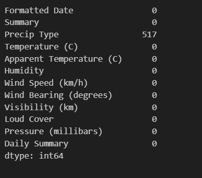
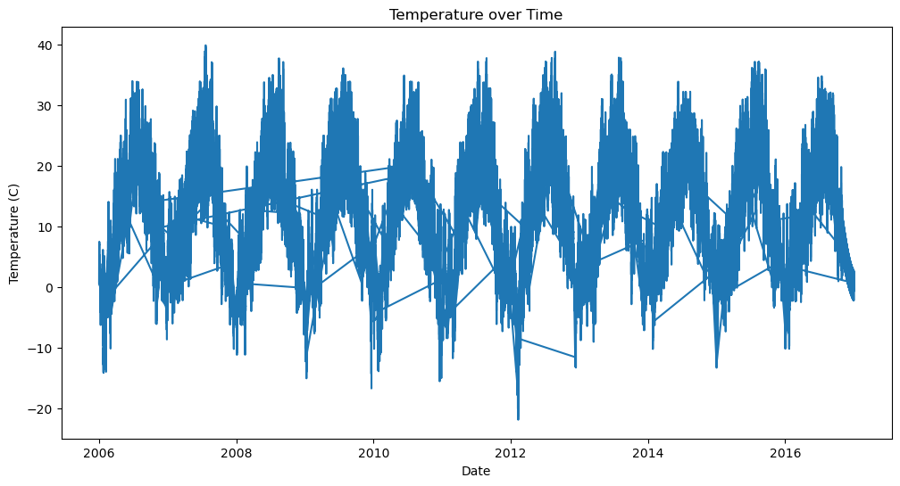
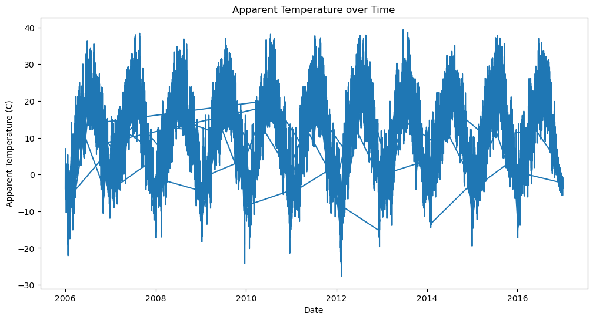
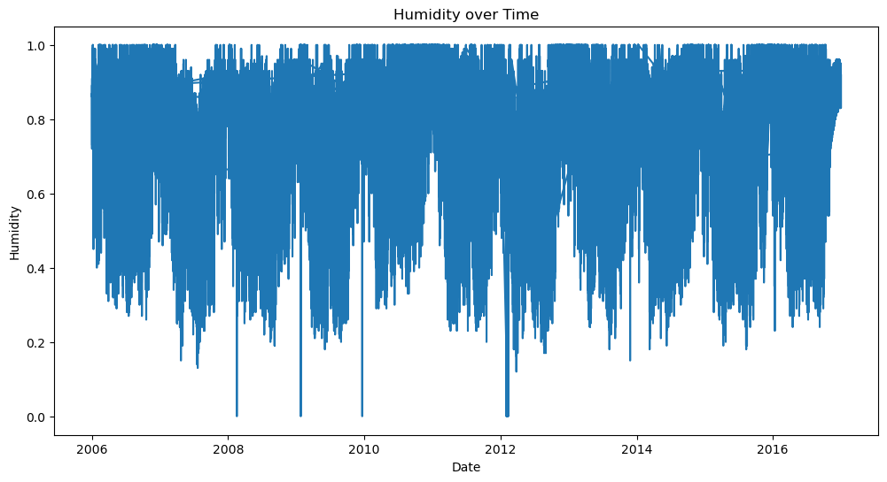
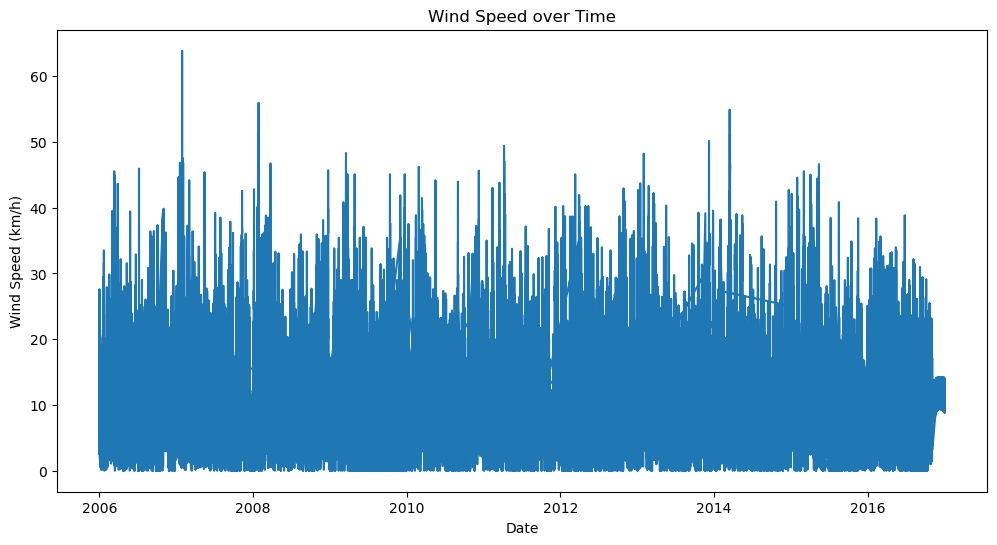
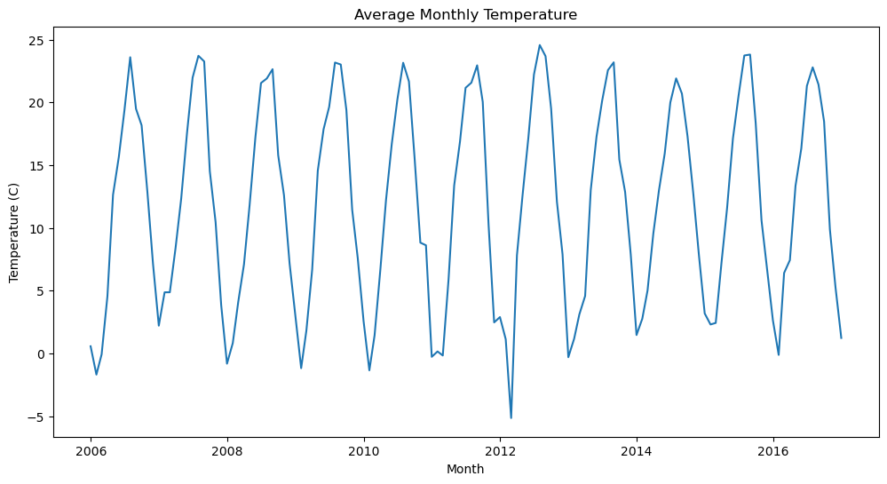
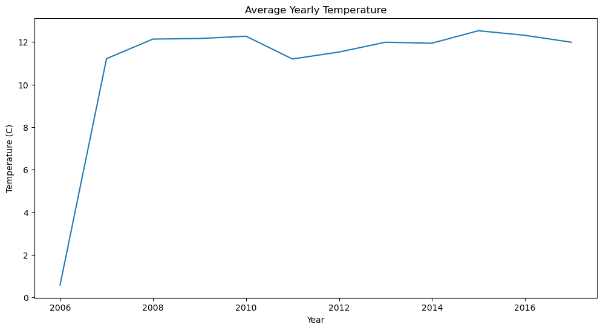

# Ex.No: 01A PLOT A TIME SERIES DATA

## Developed By : VENKATANATHAN P R

## Register Number: 212223240173

### Date: 18-08-2025

## AIM:

To develop a Python program to plot a time series data (population/market price of a commodity/temperature).

## ALGORITHM:

1. Import the required packages like pandas and matplotlib.
2. Read the dataset using pandas.
3. Handle missing values and convert the date column into datetime format.
4. Calculate the mean for the respective columns (Temperature, Apparent Temperature, Humidity, Wind Speed).
5. Extract useful features like year, month, day, hour, and day of week.
6. Plot the data over time.
7. Plot the average monthly and yearly trends.
8. Display the graphs.

## PROGRAM:

```python
import pandas as pd
import matplotlib.pyplot as plt

data = pd.read_csv("weatherHistory.csv")
data['Formatted Date'] = pd.to_datetime(data['Formatted Date'], utc=True)
data.set_index('Formatted Date', inplace=True)

print("Mean Temperature:", data['Temperature (C)'].mean())
print("Mean Apparent Temperature:", data['Apparent Temperature (C)'].mean())
print("Mean Humidity:", data['Humidity'].mean())
print("Mean Wind Speed:", data['Wind Speed (km/h)'].mean())

plt.figure(figsize=(12, 6))
plt.plot(data['Temperature (C)'])
plt.title('Temperature over Time')
plt.xlabel('Date')
plt.ylabel('Temperature (C)')
plt.show()

plt.figure(figsize=(12, 6))
plt.plot(data['Apparent Temperature (C)'])
plt.title('Apparent Temperature over Time')
plt.xlabel('Date')
plt.ylabel('Apparent Temperature (C)')
plt.show()

plt.figure(figsize=(12, 6))
plt.plot(data['Humidity'])
plt.title('Humidity over Time')
plt.xlabel('Date')
plt.ylabel('Humidity')
plt.show()

plt.figure(figsize=(12, 6))
plt.plot(data['Wind Speed (km/h)'])
plt.title('Wind Speed over Time')
plt.xlabel('Date')
plt.ylabel('Wind Speed (km/h)')
plt.show()

monthly_avg = data.resample('M').mean(numeric_only=True)
plt.figure(figsize=(12, 6))
plt.plot(monthly_avg['Temperature (C)'])
plt.title('Average Monthly Temperature')
plt.xlabel('Month')
plt.ylabel('Temperature (C)')
plt.show()

yearly_avg = data.resample('Y').mean(numeric_only=True)
plt.figure(figsize=(12, 6))
plt.plot(yearly_avg['Temperature (C)'])
plt.title('Average Yearly Temperature')
plt.xlabel('Year')
plt.ylabel('Temperature (C)')
plt.show()
```

## OUTPUT:
















## RESULT:

Thus, we have successfully developed a Python program to plot the time series of the given dataset.


